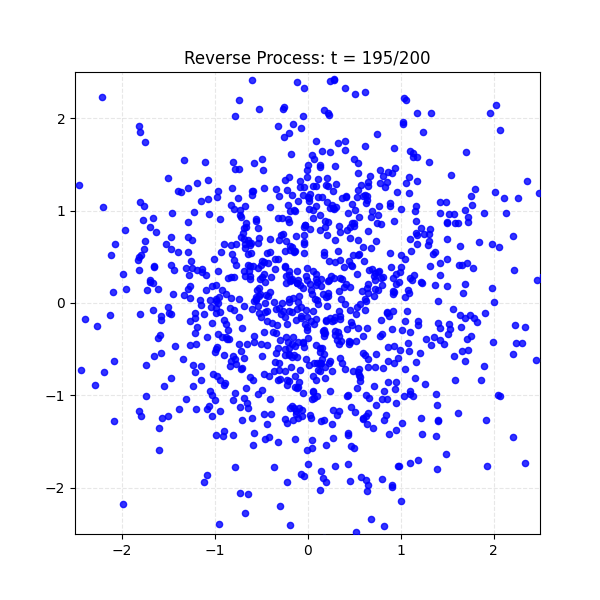

# Denoising Diffusion Probabilistic Model (DDPM) Implementation

[](https://www.python.org/)
[](https://pytorch.org/)
[](https://scikit-learn.org/)

HackMD Article : https://hackmd.io/@bGCXESmGSgeAArScMaBxLA/HkcbC12zWe

This is a **PyTorch** implementation of the **Denoising Diffusion Probabilistic Model (DDPM)**. This project includes simple implementations ranging from 2D toy datasets (Swiss Roll) to complex image datasets (Oxford Pets), aiming to demonstrate the Forward diffusion and Reverse denoising processes of diffusion models.

## 📂 Project Structure

```text
.
├── DDPM/                   # Core algorithm implementation
│   ├── ForwardProcess.py   # Defines the forward diffusion process (q-sample)
│   ├── ReverseProcess.py   # Defines the reverse denoising process (p-sample)
│   └── NoisePredictor.py   # UNet architecture and noise prediction model
├── DDPM_Image.py           # Training script for the Oxford Pets dataset
├── DDPM_Swiss_Roll.py      # Training and visualization script for the 2D Swiss Roll dataset
├── Dataset.py              # Data loader (supports Oxford-IIIT Pet cat breeds)
├── Plot/                   # Directory to store training results and generated GIFs
├── data/                   # Directory for dataset storage
└── README.md               # Project documentation
```

## 🚀 Installation

### 1. Clone the repository
```bash
git clone https://github.com/jason19990305/Denoising-Diffusion-Probabilistic-Model.git
cd Denoising-Diffusion-Probabilistic-Model
```

### 2. Install Dependencies
It is recommended to use a virtual environment (Conda or venv). This project primarily uses **PyTorch** and **Torchvision**.

```bash
# Install core dependencies
pip install torch torchvision numpy matplotlib scikit-learn imageio
```

## 🖥️ Usage

### 1. 2D Toy Dataset: Swiss Roll
A lightweight experiment designed to provide an intuitive understanding of how diffusion models transform noise into a specific distribution shape.
```bash
python DDPM_Swiss_Roll.py
```
*   **Forward Process**: Gradually transforms the Swiss Roll data into Gaussian noise.
*   **Reverse Process**: Reconstructs the Swiss Roll shape from pure noise.

### 2. Image Generation: Oxford Pets (Cats Only)
Training on real images with the goal of generating high-resolution cat images.
```bash
python DDPM_Image.py
```
*   By default, it uses specific cat breeds from the `Oxford-IIIT Pet` dataset for filtering and training.
*   Includes the **EMA (Exponential Moving Average)** mechanism to improve generation quality.

## 📊 Results & Visualization

Once training is complete, the generated images and animations will be saved in the `Plot/` directory.

### 2D Swiss Roll Reverse Generation
*(Example Visualization)*


### Image Generation Process (Cats)
*(Example Visualization)*


## 💡 Technical Highlights
- **UNet Architecture**: Utilizes a custom `DiffUNet` with Time Embeddings.
- **Beta Schedule**: Implements a Linear Schedule (`beta_start=1e-4`, `beta_end=0.02`).
- **EMA Training**: Enhances generation stability through Exponential Moving Average of model parameters.
